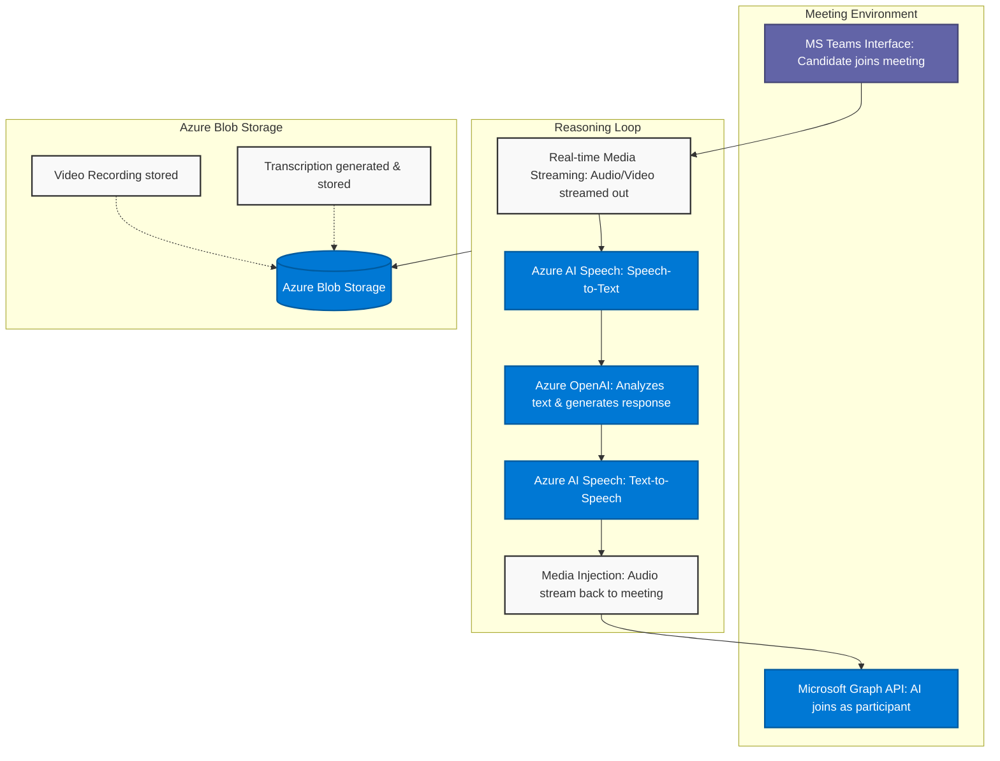

# AI Based Recruitment Platform

This document outlines the high-level architecture of the AI Based Recruitment Platform, specifically detailing the interview process conducted over Microsoft Teams and the subsequent automated evaluation and report generation phases.

---

## Step 2: Interview on Teams

The interview phase is driven by a real-time interaction loop between the candidate and the AI. The AI joins the Microsoft Teams meeting as an active participant, processing the candidate's responses and dynamically generating follow-up questions.

### Core Architecture Flow



### Key Azure Services Utilized

| Azure Service | Role / Functionality |
| :--- | :--- |
| **Microsoft Graph API** | Enables automation, integration, and advanced data analysis by adding the Teams app for the AI bot. The AI joins the meeting as a participant using this API. |
| **Azure AI Speech (STT)** | **Speech-to-Text:** Transcribes the candidate's voice into text instantly and accurately in real-time. |
| **Azure OpenAI** | Understands the conversation context, analyzes the transcribed text, and generates smart, unscripted follow-up questions (LLM processing). |
| **Azure AI Speech (TTS)** | **Text-to-Speech:** Synthesizes the AI's generated textual response back into natural-sounding audio for the conversation. |
| **Azure Blob Storage** | Stores the recorded video of the meeting and the full conversation transcription (e.g., in PDF format) after the meeting completes. |

---

## Step 3: Report Generation / Evaluation

After the interview concludes, the platform processes the gathered data against the candidate's resume to generate a comprehensive evaluation and scoring report.

### Evaluation Flow

```mermaid
graph LR
    classDef azure fill:#0078D4,stroke:#005A9E,stroke-width:2px,color:#fff;
    classDef evaluation fill:#E1DFDD,stroke:#333,stroke-width:2px;
    classDef dashboard fill:#107C10,stroke:#0B5A0B,stroke-width:2px,color:#fff;

    subgraph Data_Inputs [Inputs - Azure Blob Storage]
        direction TB
        Transcription[Interview Transcription]:::azure
        Resume[Shortlisted Resume]:::azure
    end

    LLMEval[LLM for Evaluation\n(Azure OpenAI)]:::azure

    subgraph Evaluators [Evaluation Modules]
        direction TB
        TechEval[Technical Evaluator:\nBased on interview responses]:::evaluation
        SoftEval[Soft Skills Evaluator:\nAnalyzes audio/behavior]:::evaluation
    end

    Report[Comprehensive Evaluation\n& Report Generation\n(Azure Blob Storage)]:::azure
    UI[UI Dashboard Element]:::dashboard

    Transcription --> LLMEval
    Resume --> LLMEval

    LLMEval --> TechEval
    LLMEval --> SoftEval

    TechEval --> Report
    SoftEval --> Report

    Report --> UI
```

### Evaluation Process Breakdown

1. **Data Aggregation:** The system retrieves the candidate's **Shortlisted Resume** and the complete **Interview Transcription** from Azure Blob Storage.
2. **LLM Evaluation (Azure OpenAI):** An evaluation-specific LLM processes the combined inputs to understand the context of the candidate's background versus their actual interview performance.
3. **Specialized Evaluator Agents:**
   - **Technical Evaluator:** Assesses the candidate's technical proficiency and correctness based directly on their responses to the technical questions asked during the interview.
   - **Soft Skills Evaluator:** Evaluates communication skills, confidence, and behavioral traits utilizing the interview recording/audio and transcribed conversational flow.
4. **Report Generation:** The outputs from both evaluators are compiled into a **Comprehensive Evaluation Report**. This final report is securely saved back into Azure Blob Storage.
5. **Dashboard Rendering:** The final results and metrics are surfaced to the recruiters or hiring managers via the frontend **UI Dashboard Element**.
